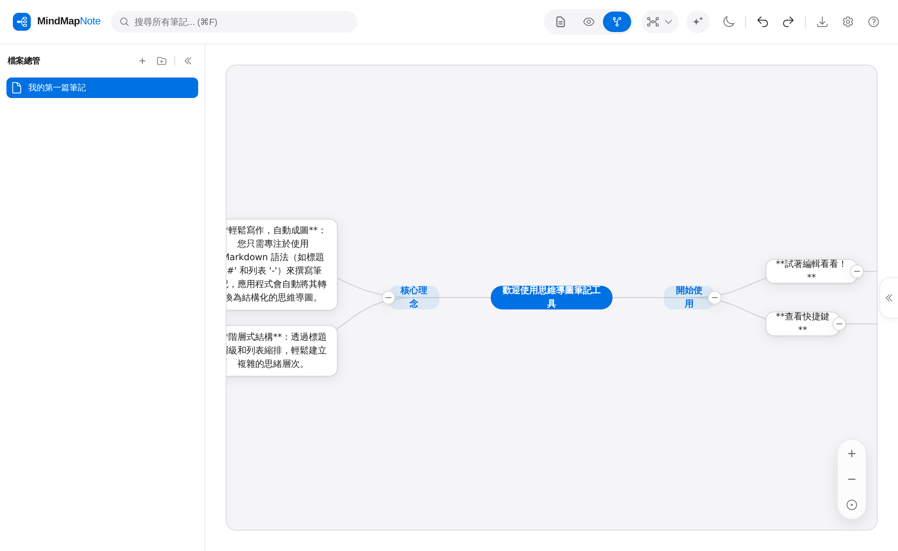

<div align="center">


# MindMapNote

**用 Markdown 寫筆記，自動整理成心智圖。**

一款極簡的筆記工具：你只管寫，階層結構會即時長成可互動的心智圖 —— 不需要額外拖拉節點、不需要學新語法。所有資料留在你自己的瀏覽器裡。



</div>

## 特色功能

- **Markdown 即心智圖** — 用標題 (`#`) 和列表 (`-`) 撰寫筆記，畫面即時轉換成階層式心智圖，三種版面（心智圖 / 邏輯圖 / 組織圖）可切換。
- **雙向編輯** — 在編輯器改文字，或直接在心智圖上雙擊節點重新命名，兩邊即時同步。
- **檔案總管 + 大綱** — 合併成同一個側邊欄，用頁籤切換：瀏覽所有筆記，或依標題層級瀏覽目前筆記的大綱並跳轉到對應行，任何檢視模式下都能使用。
- **響應式 / 行動裝置友善** — 手機瀏覽器會自動切換成精簡版頂欄與全螢幕側邊欄，觸控操作（縮放、平移、點選）皆已調整適配。
- **全文搜尋** — 跨所有筆記搜尋，顯示比對片段，一鍵跳轉 (`⌘F`)。
- **圖片支援** — 貼上或拖曳圖片直接插入筆記與心智圖節點。
- **匯出** — 筆記匯出成 `.md`，心智圖匯出成高解析度 `.jpg`。
- **復原 / 重做** — 完整的編輯歷史，`⌘Z` / `⌘⇧Z`。
- **深色模式** — 跟隨系統風格切換，所有畫面皆有對應主題。
- **AI 學習夥伴（選用）** — 串接 Google Gemini，針對目前筆記內容摘要、出題、答疑。金鑰只存在你自己的瀏覽器，不會出現在部署的程式碼中，也可以完全不用。
- **語音筆記（選用）** — 用麥克風錄音，或直接上傳音檔，透過 Groq 轉成逐字稿，再由 Gemini 自動整理成一篇結構化筆記。長時間錄音會自動分段即時轉錄；上傳超過 Groq 單檔上限（25 MB）的音檔也會在瀏覽器端自動切割成多段再分別轉錄，不需要自己先處理。面板可以縮小到背景，轉錄與生成完成後會自動建立筆記並提示，不需要一直盯著等待。原始錄音與逐字稿會完整保留在本機瀏覽器（IndexedDB）裡以便日後核對，設定頁面可查看目前佔用空間並隨時清除。
- **本機優先、注重隱私** — 所有筆記、圖片都存在瀏覽器 `localStorage`，沒有帳號、沒有後端伺服器。
- **備份與還原** — 在設定裡一鍵把整個工作區（所有筆記、資料夾、圖片）匯出成單一 JSON 檔，換裝置、重灌瀏覽器前都能先備份，也能隨時匯入還原。
- **可安裝、支援離線** — 支援加入手機主畫面或電腦桌面當作獨立 App 開啟，離線時也能繼續編輯筆記。

## 技術棧

[React 19](https://react.dev/) · [TypeScript](https://www.typescriptlang.org/) · [Vite](https://vite.dev/) · [Tailwind CSS](https://tailwindcss.com/) · [D3.js](https://d3js.org/)（心智圖版面運算與互動）· [marked](https://marked.js.org/) + [DOMPurify](https://github.com/cure53/DOMPurify)（Markdown 預覽）· [@google/genai](https://ai.google.dev/)（AI 學習夥伴、語音筆記生成）· [Groq](https://groq.com/)（語音轉錄）· [vite-plugin-pwa](https://vite-pwa-org.netlify.app/)（可安裝、離線支援）

## 快速開始

**環境需求：** Node.js 18 以上

```bash
# 1. 安裝套件
npm install

# 2. 啟動開發伺服器
npm run dev
```

開啟瀏覽器後即可使用。想啟用 AI 學習夥伴的話，點擊右上角的設定 (⚙️) 圖示，貼上你自己的 [Gemini API 金鑰](https://aistudio.google.com/apikey) 即可 —— 金鑰只會存在這台裝置的瀏覽器 `localStorage`，不會被打包進程式碼、也不會上傳到任何伺服器。這一步是選用的，不影響編輯器、心智圖、檔案總管等其他功能。

想啟用語音筆記功能，除了 Gemini 金鑰之外，還需要在同一個設定頁面貼上 [Groq API 金鑰](https://console.groq.com/keys)（同樣只存在瀏覽器裡）。點擊頂欄的麥克風圖示即可開始錄音，停止後會自動轉錄成逐字稿並生成一篇新筆記。

### 其他指令

```bash
npm run build    # 建置正式版
npm run preview  # 預覽建置後的成果
```

## 鍵盤快捷鍵

| 功能 | 快捷鍵 |
| --- | --- |
| 切換編輯 / 預覽 / 心智圖視圖 | `⌘1` / `⌘2` / `⌘3` |
| 搜尋筆記 | `⌘F` |
| 復原 / 重做 | `⌘Z` / `⌘⇧Z` |
| 心智圖：導航節點 | `↑` `↓` `←` `→` |
| 心智圖：編輯選定節點 | `Enter` |
| 心智圖：展開 / 折疊節點 | `Space` |
| 心智圖：縮放 | `⌘+` / `⌘-` / `⌘0` |

應用程式內按 `?` 可隨時打開完整的快捷鍵說明。

## License

本專案採用 [MIT License](LICENSE) 授權。
